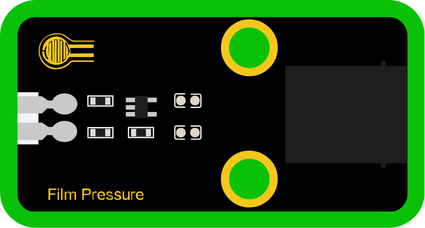
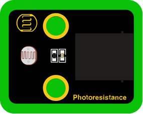
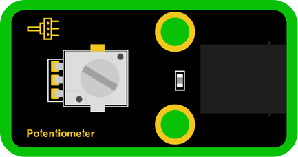
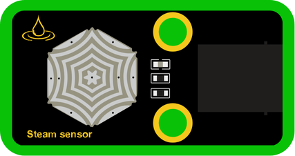

# 🟩 Analog

### What is Analog?

Analog signals are smooth and continuous. They can represent values that change gradually—like light, pressure, or temperature.  
Analog sensors read these changing values from the physical world and convert them into numbers the microcontroller can understand.

---

### Included Modules:

- [Film Pressure](#module-01-film-pressure-sensor)  
- [Photoresistor](#module-02-photoresistor)  
- [Potentiometer](#module-03-potentiometer)  
- [Steam Sensor](#module-04-steam-sensor)  

---

### Module 01: Film Pressure Sensor

#### Block:

This sensor reads **pressure**. When you press on it, it gives a higher value based on how strong the pressure is.

---

### Module 02: Photoresistor

#### Block:

This sensor reads **light**. The brighter the light, the higher the value it gives.

---

### Module 03: Potentiometer

#### Block:

This sensor reads **rotation or position**. Turning the knob changes the value, making it useful for adjusting brightness, speed, or volume.

---

### Module 04: Steam Sensor

#### Block:

This sensor reads **moisture in the air** (humidity). It's useful in weather stations or projects that detect steam or damp environments.

---
