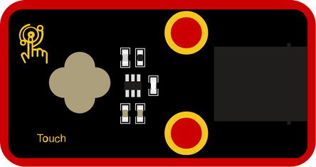
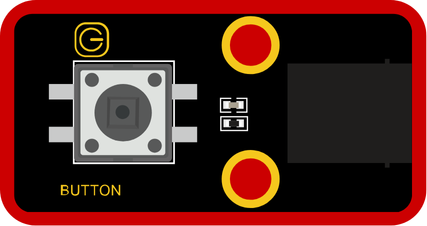
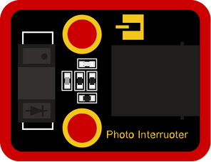
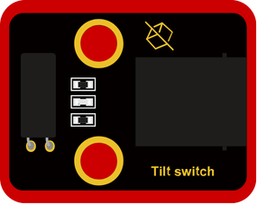
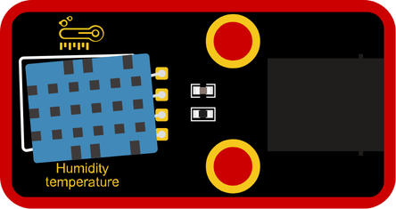
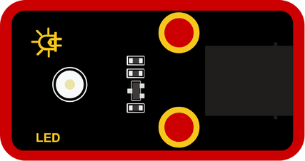
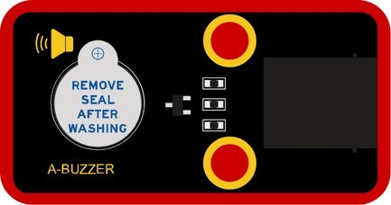
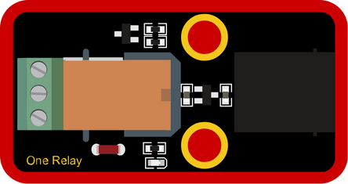

# 🟥 Digital

### What is Digital?

Digital signals are either **ON** or **OFF**—like a light switch.  
Digital sensors detect clear changes (like pressing a button), while digital outputs perform actions (like turning on a light or sound).

---

### Included Modules:

#### 🔌 Inputs:
- [Touch Sensor](#module-01-touch-sensor)  
- [Button Input](#module-02-button-input)  
- [Photo Interrupter](#module-03-photo-interrupter)  
- [Tilt Switch](#module-04-tilt-switch)  
- [Temp & Humidity](#module-05-temp--humidity)

#### 💡 Outputs:
- [LED](#module-06-led)  
- [Buzzer](#module-07-buzzer)  
- [Relay](#module-08-relay)  

---

### Module 01: Touch Sensor

#### Block:

This sensor detects when it is touched. It sends an ON signal when touched and OFF when released.

---

### Module 02: Button Input

#### Block:

This sensor detects when the button is pressed. It sends an ON signal while the button is held down.

---

### Module 03: Photo Interrupter

#### Block:

This sensor detects if something passes between its light beam. It is commonly used to count or detect movement.

---

### Module 04: Tilt Switch

#### Block:

This sensor detects tilt or angle changes. It sends an ON signal when tilted beyond a certain point.

---

### Module 05: Temp & Humidity

#### Block 1:

This block reads the **temperature** from the environment.

#### Block 2:

This block reads the **humidity** (moisture in the air).

---

### Module 06: LED

#### Block 1:

This block turns the LED ON or OFF using a **true/false** value.

#### Block 2: (PWM)

This block adjusts the LED brightness by entering a value between **0 and 1023**.

---

### Module 07: Buzzer

#### Block 1:

This block turns the buzzer ON or OFF using a **true/false** value.

#### Block 2: (PWM)

This block changes the buzzer’s sound level using a value between **0 and 1023**.

---

### Module 08: Relay

#### Block:

This block controls the relay like a switch—**ON or OFF**—allowing you to turn other devices on or off through the relay.

---
