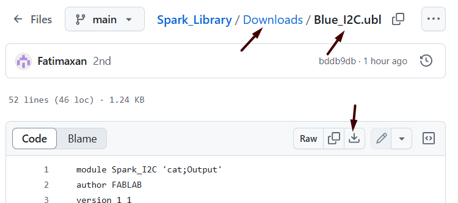
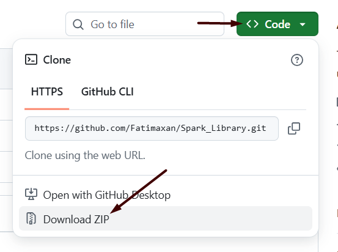
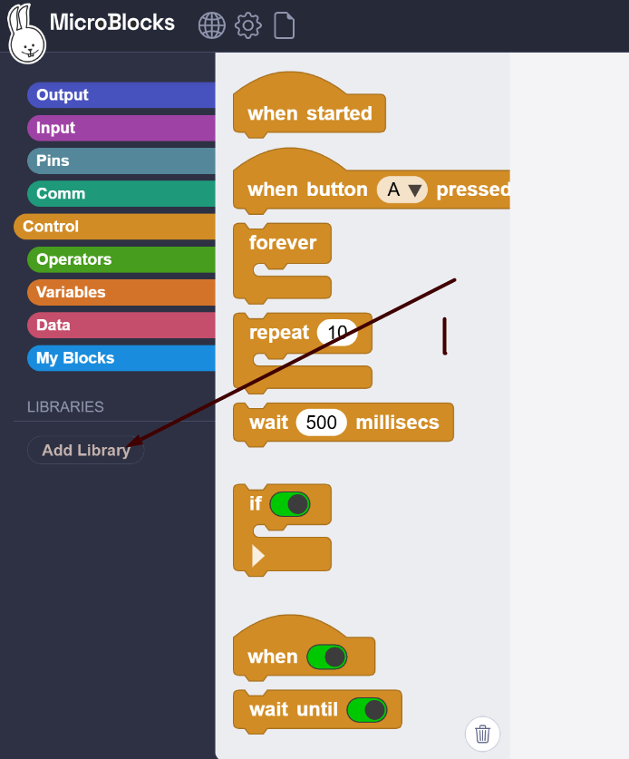
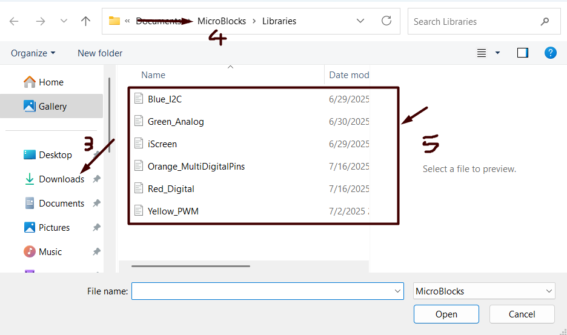

# 🚀 How to Download the Spark Libraries

Follow these simple steps to download and prepare the Spark library files for your project.

---

## 📥 Step 1: Download the Files

Click the links below to download each library file:

- [iScreen](../Downloads/iScreen.ubl)  
- [Analog](../Downloads/Green_Analog.ubl)  
- [Digital](../Downloads/Red_Digital.ubl)  
- [I2C](../Downloads/Blue_I2C.ubl)  
- [PWM](../Downloads/Yellow_PWM.ubl)  
- [MDP (Multi-Digital Pins)](../Downloads/Orange_MultiDigitalPins.ubl)

Make sure all the files are saved to your computer.

---

## 📁 Step 2: Find the Downloaded Files

Once downloaded, go to your **Downloads** folder to check if the files are there.

> 🔎 Tip: Make sure the path is correct so you don’t lose track of them.

---

## 💡 Another Way to Download

Some systems may offer a different way to download the files, like this:

If that happens, just follow the prompts and confirm the download.

---

## 🗃️ Extract and Organize

If the files come in a compressed folder (ZIP), right-click the folder and choose **"Extract All"**.

Then, move the extracted files to your main **Downloads** folder for easy access.

---

## 🌐 Step 3: Open MicroBlocks

Click [here](https://microblocks.fun/run-pilot/microblocks.html) to open the **MicroBlocks Pilot version** in your browser.

---

## 📚 Step 4: Add the Libraries in MicroBlocks

In MicroBlocks:

1. Click on **"Add Library"** (usually at the bottom of the block categories).

2. A file browser will open.  

3. Choose the `.ubl` files you downloaded earlier (you can add them one by one).

Once added, the blocks from those libraries will appear and be ready to use!

---