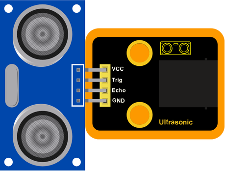
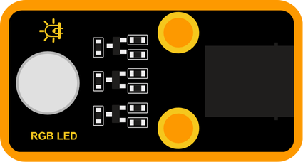
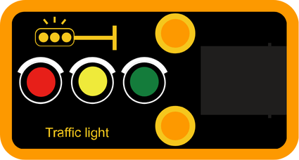

# 🟧 Multi-Digital Pins

### What are Multi-Digital Pins?

Some modules use **more than one digital pin** to work correctly. These pins may be used to send or receive multiple signals at the same time—like controlling several LEDs, reading from multiple buttons, or sending commands to more complex components.

---

### Included Modules:

#### 🔌 Inputs:
- [Ultrasonic](#module-01-7-segment-display)

#### 💡 Outputs:
- [RGB LED](#module-01-7-segment-display)
- [Traffic Light](#module-01-7-segment-display)

---

### Module 01: Ultrasonic

#### Block:

This sensor reads input from the physical world.

---

### Module 2: RGB LED

#### Block 1:

This block allows to control red, green and blue color as on and off.

#### Block 2: (PWM)

This block allows to control red, green and blue color in a range 0-255.

---

### Module 03: Traffic Light

#### Block 1:

This block allows to control red, yellow and green color as on and off.

#### Block 2: (PWM)

This block allows to control red, yellow and green color in a range 0-255.

---
