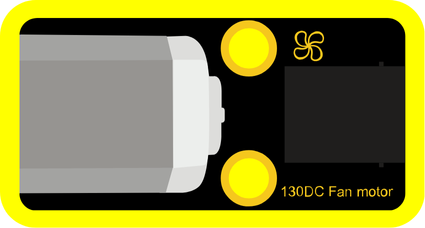

# 🟨 PWM

### What is PWM?

PWM (Pulse Width Modulation) is a technique used to **control power** to devices by turning the signal on and off very quickly.  
By adjusting how long the signal stays on during each cycle, we can control things like **brightness**, **speed**, or **intensity**.

---

### Included Modules:

- [Fan Motor](#module-01-fan-motor)

---

### Module 01: Fan Motor

#### Block 1:

This block controls the fan speed in a range from **1 to 100**.

#### Block 2:

This block controls the fan speed in a range from **1 to 1023**.

#### Block 3:

This block controls the fan speed in a range from **1 to 100**, with **direction control**.

#### Block 4:

This block controls the fan speed in a range from **1 to 1023**, with **direction control**.

---
