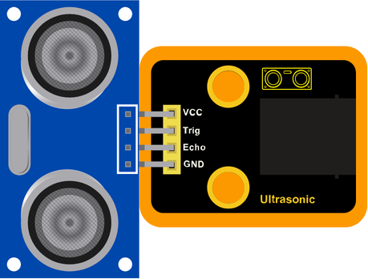
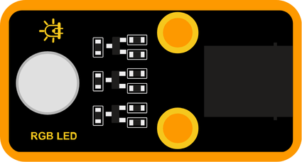

# 🟧 Multi-Digital Pins

### What are Multi-Digital Pins?

Some modules use **more than one digital pin** to work properly. These pins allow the module to send or receive multiple signals at the same time—for example, controlling multiple LEDs, handling different colors, or measuring distance with precise timing.

---

### Included Modules:

#### 🔌 Inputs:
- [Ultrasonic Sensor](#module-01-ultrasonic-sensor)

#### 💡 Outputs:
- [RGB LED](#module-02-rgb-led)
- [Traffic Light](#module-03-traffic-light)

---

### Module 01: Ultrasonic Sensor

#### Block:

This sensor reads **distance** from the physical world using ultrasonic sound waves. It uses **two pins**: one to trigger the signal and one to receive the echo.

---

### Module 02: RGB LED

#### Block 1:

This block controls the **red**, **green**, and **blue** channels using **ON/OFF** values.

#### Block 2:

This block controls the brightness of **red**, **green**, and **blue** individually, using values from **0 to 255** to mix custom colors.

---

### Module 03: Traffic Light

#### Block 1:

This block turns the **red**, **yellow**, and **green** lights **ON or OFF**.

#### Block 2:

This block allows you to adjust the **brightness** of the red, yellow, and green lights using values from **0 to 255**.

---
