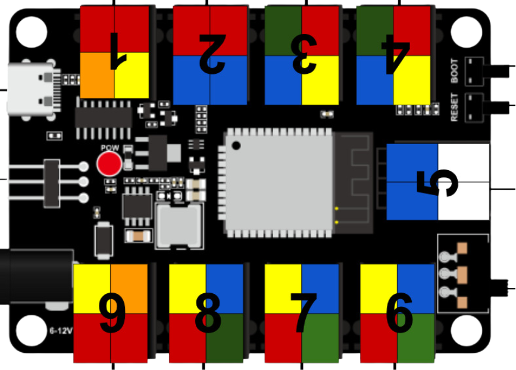

# Spark Kit!

[Spark](https://fablab.bh/spark/) is a course by FABLAB BH that teaches students the basics of electronics and coding using the Spark Kit and MicroBlocks. What’s cool is that students in the program also teach other students!

---
## Microcontroller

### 🌟 What is this board, and what is it used for?
This is a **Microcontroller**, think of it like a power strip for electronic parts! You can plug in cool things like lights, buttons, or sensors without needing to do any wiring or soldering. It helps you build projects easily—just plug and play!

### 🎨 What do the different pin colors (red, black, yellow, blue, green, white) mean?
These colors help you quickly understand what kind of signal each port uses. Think of it like a superhero color code—each one has a special job!

🟢 Green = Analog pins
These can read smooth changes, like how much light or how hot something is.

🔴 Red = Digital pins
These are for ON/OFF things, like turning a light on or off.

🔵 Blue = I2C pins
These are used when devices need to talk to each other, like a screen or a sensor sending data.

🟡 Yellow = PWM pins
These can control brightness or speed, like dimming an LED or changing motor speed.

🟠 Orange = Multiple Digital pins
These ports can control more than one digital signal, good for things like RGB LEDs!

### 🔢 Why are the ports numbered from 1 to 9? What’s the purpose of these numbers?
The numbers help you quickly know where things are plugged in.

When you're building your project or writing code, the numbers make it easier to say:
➡️ “My button is in port 2” or “The LED goes in port 6.”

We use these numbers when we explain things to you, so you can follow along easily and not get confused.
It's like giving every port a name—so we can talk to them and work together as a team! 👩‍🏫👨‍🔧

---
## Issues and Solutions

### 🛠️ Issue 1: Incorrect Pin Mapping
The pins shown in MicroBlocks didn’t match the actual pins on the microcontroller.

✅ Solution: We created a drop-down menu that shows the correct pin numbers as labeled on the microcontroller.

### 🛠️ Issue 2: Inverted Module Behavior
Some modules behaved in reverse—turning ON in code would turn them OFF in real life (and vice versa).

✅ Solution: We created custom blocks that automatically handle inverted logic for those modules.

### 🛠️ Issue 3: Modules Needing Multiple Pins
Some modules, like RGB LEDs, required controlling multiple pins at once, which made coding harder and repetitive.

✅ Solution: We created dedicated blocks for these modules that manage all required pins together, making it easier to control them with a single command.

### 🛠️ Issue 4: Complex Modules with Many Features
Some modules had more than one function (like color + brightness), making it tricky to support all features in one block.

✅ Solution: We made more than one block per module when needed, each one focusing on a specific feature (e.g. one for color, one for brightness).

---
## These Modules Got Blocks!

| Digital                | Analog             | I2C                              | PWM                     | Multi-pin Modules               |
|------------------------|--------------------|----------------------------------|--------------------------|----------------------------------|
| LED                    | Film Pressure      | OLED Display (Copied)            | Fan Motor               | Ultrasonic (Dependencies)        |
| Buzzer                 | Photoresistor      | Motor Driver                     | Servo (Dependencies)    | RGB LED                          |
| Horn                   | Potentiometer      | Gesture Sensor (Dependencies)    | —                        | Traffic Light                    |
| Touch Sensor           | Steam Sensor       | —                                | —                        | —                                |
| Button Input           | —                  | —                                | —                        | —                                |
| Photo Interrupter      | —                  | —                                | —                        | —                                |
| Tilt Switch            | —                  | —                                | —                        | —                                |
| Temp & Humidity (Dependencies) | —          | —                                | —                        | —                                |
| Relay                  | —                  | —                                | —             