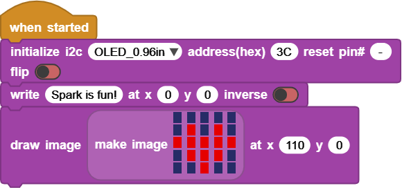

# 🖥️ iScreen

This library is already documented in the [MicroBlocks Wiki](https://wiki.microblocks.fun/en/extension_libraries/oled).

---

## ✏️ Examples

You can use this library to **write messages** and **draw shapes** on the screen.

You can also draw letters, especially useful when **non-English languages** are not supported in MicroBlocks.

